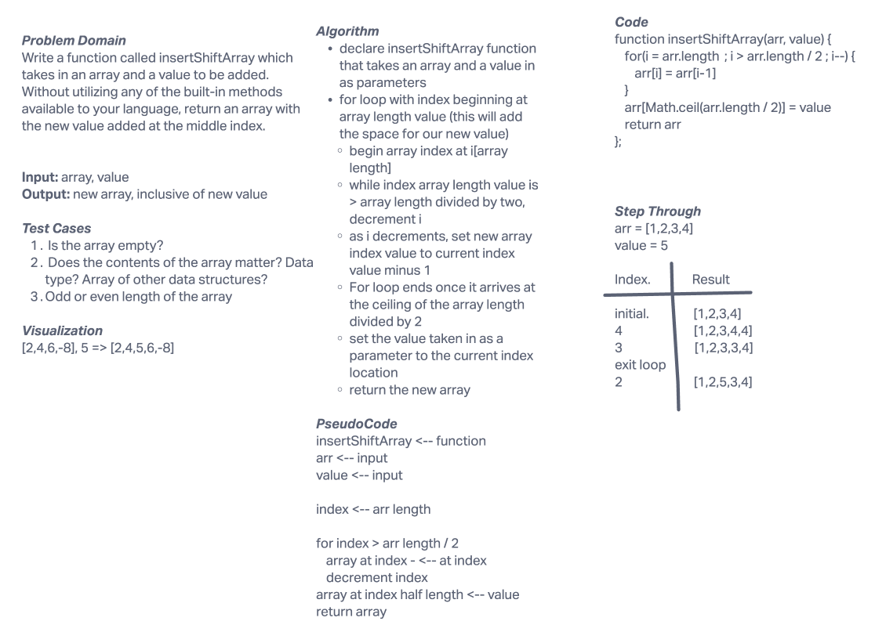

# Insert to Middle of an Array
Write a function called insertShiftArray which takes in an array and a value to be added. Without utilizing any of the built-in methods available to your language, return an array with the new value added at the middle index.

## Whiteboard Process

## Approach & Efficiency
We chose to use a for loop to add an additional index to the end of the provided array. From there we had the loop decrement through the array until it reached the Math.ceil of the length of the array divided by two (the calculated middle point). From there we set the value of the midpoint index to the value that was accepted as a parameter.
