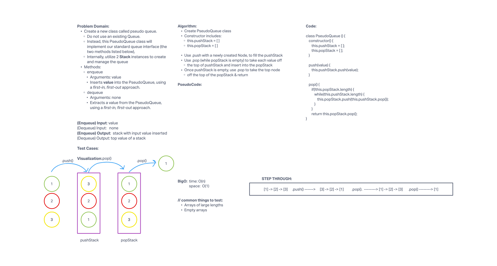

# Challenge Summary

Implement a Queue using two Stacks.

### Feature Tasks

Create a new class called pseudo queue.
  - Do not use an existing Queue.
  - Instead, this PseudoQueue class will implement our standard queue interface (the two methods listed   below),
  - Internally, utilize 2 Stack instances to create and manage the queue

Methods:
  - enqueue
    - Arguments: value
    - Inserts value into the PseudoQueue, using a first-in, first-out approach.
  - dequeue
    - Arguments: none
    - Extracts a value from the PseudoQueue, using a first-in, first-out approach.

## Whiteboard Process

## Approach & Efficiency

We chose to use .push with a newly created Node to fill the pushStack. From there we use .pop (while popStack is empty) to take each value off the top of pushStack and insert it into popStack.

Once the pushStack is empty, use .pop to take the top node off the top of popStack and return that value.

## Solution

'use strict';

class PseudoQueue {
  constructor() {
    this.pushStack = [];
    this.popStack = [];
  }

  push(value) {
    this.pushStack.push(value);
  }

  pop() {
    if(!this.popStack.length) {
      while(this.pushStack.length) {
        this.popStack.push(this.pushStack.pop());
      }
    }
  }

  return this.popStack.pop();

}
