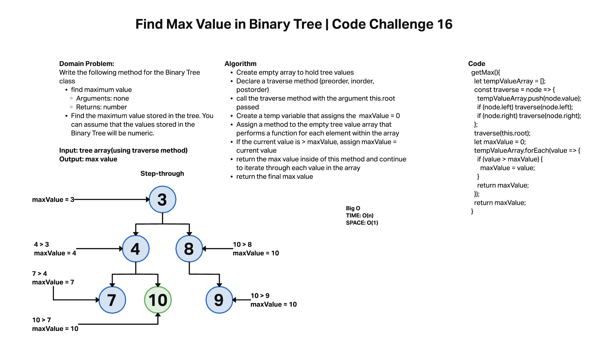

# Challenge Summary

Add a method to a Binary Search Tree that returns the largest value in the tree.

## Whiteboard Process

## Approach & Efficiency
We created an empty array to hold our tree values. We then traveresed the tree and pushed each value into our array. We then used a forEach method on this array to reduce the array to its largest value. We then returned that max value.

## Solution

getMax(){
    let tempValueArray = [];
    const traverse = node => {
      tempValueArray.push(node.value);
      if (node.left) traverse(node.left);
      if (node.right) traverse(node.right);
    };
    traverse(this.root);
    let maxValue = 0;
    tempValueArray.forEach(value => {
      if (value > maxValue) {
        maxValue = value;
      }
      return maxValue;
    });
    return maxValue;
  }
